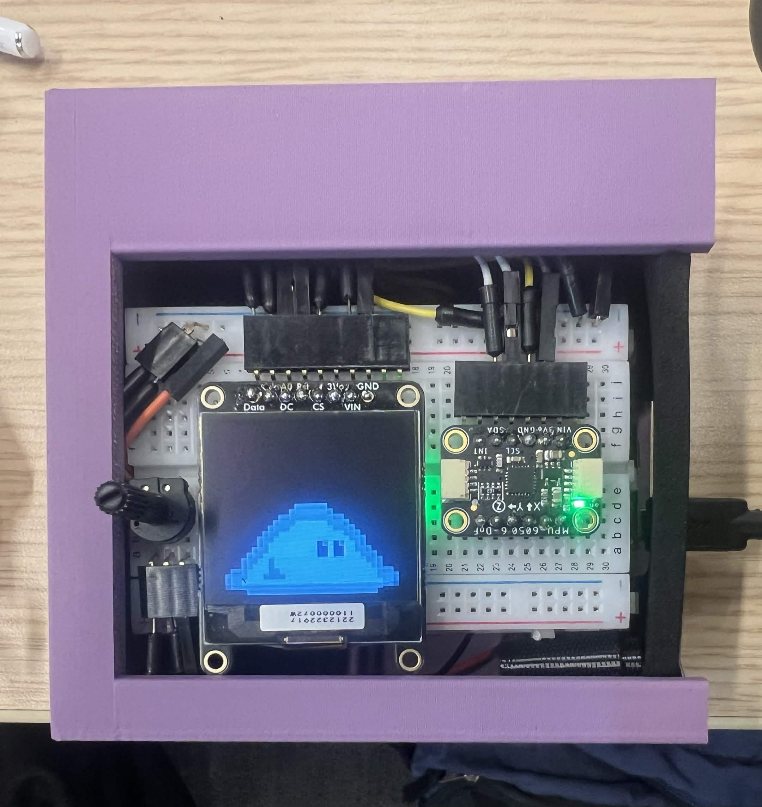

# Edugotchi



A hackathon-built ESP32-S3 gadget that acts as an **educational alarm clock / desk pet**. A pixel-art creature animates on a little OLED, and to dismiss an "alarm" (or just on a whim) you answer a short quiz using a dial. Results are logged to a small Node server with a parent-facing web dashboard.

This was built in a weekend. The README below tries to describe what the code *actually* does, including the rough edges.

---

## What it actually does

The device sits in one of a few states (`IDLE`, `QUESTION_DISPLAY`, etc.). A quiz session starts one of two ways:

1. **Shake it** — the MPU6050 detects acceleration above a threshold and kicks off a session.
2. **Remote trigger** — the device runs a tiny web server on **port 80** with a `/startAlarm` endpoint. Hitting it sets the device into "alarm" mode. (This is the "alarm clock" half of the project; there's no on-device clock/scheduling — something else has to call `/startAlarm`.)

The device also exposes `/status`, `/stopAlarm`, and `/setDifficulty?level=...` on port 80, which were mostly used for debugging.

While idle, the creature plays different walk/idle animations based on how you tilt and move the device (low-pass-filtered accelerometer → animation). The sprites are repurposed RPG-style frames (attack, dodge, magic, death), so e.g. a **wrong answer plays a "death" animation** — it's cosmetic.

### The quiz loop

A session runs until you answer **5 questions correctly** (`QUESTIONS_TO_WIN = 5`). A wrong answer or a per-question timeout (100 s) re-shows the same question rather than advancing; the `wrong` counter tracks misses along the way.

You answer with a **potentiometer dial**: turning it highlights one of four options (A/B/C/D), and you **hold the selection for 1.5 seconds** to confirm. Finishing all 5 plays a short victory melody on the buzzer (if audio is enabled).

### Where questions come from

`GET /question` on the Node server calls the **OpenAI API** (`gpt-4o-mini`) to generate an age-appropriate multiple-choice question for a chosen subject.

**If the server has no `OPENAI_API_KEY`, or there's no Wi-Fi, this does not work** — the request fails (or never happens) and the firmware falls back to a **hardcoded set of 5 questions** baked into `firmware/quiz.h`. So out of the box, with no API key configured, the device just cycles those 5 questions. "AI-generated" only happens once you set up a key.

### Difficulty (handled server-side, not on the device)

The README used to imply the device adapts difficulty. It doesn't. The `difficulty` value in the firmware is hardcoded to `"easy"` (`edugotchi.ino`) and is only ever changed by a debug HTTP endpoint (`/setDifficulty`); `fetchStats()` reads back only the streak and ignores the `difficulty` the server returns. So the device **always** requests `?difficulty=easy` (`quiz.h`).

Difficulty selection actually lives entirely on the Node server: it keeps a single global `easy` / `medium` / `hard` value, adjusts it in `/report/wakeup`, and ignores the query param the device sends — substituting its own stored level when generating a question.

---

## Parent Dashboard

The Node server serves a dashboard at `http://<server-ip>:3000/portal`. It shows:

- **Learning streak** — consecutive calendar days with at least one completed session
- **Accuracy** — overall `correct / (correct + wrong)` across all sessions
- **Subject performance** — per-subject accuracy bars. Subject selection is weighted so weaker/under-sampled subjects appear more often (`pickSubject` in `server/subjects.js`)
- **Session history** — recent sessions with score and difficulty level
- **Current level** — easy / medium / hard, adjusted server-side
- **Category toggles** — enable/disable whole subject categories (Math, Geography, etc.), saved via `POST /settings`

All data is stored in a plain `server/data.json` file. There are no accounts and no per-child separation — it's a single shared dataset.

---

## Hardware

| Component | Part | Notes |
|---|---|---|
| Microcontroller | ESP32-S3 | |
| Display | SSD1327 128×128 grayscale OLED | **I²C**, address `0x3D`, on `Wire1` |
| Motion | MPU6050 IMU | **I²C**, address `0x68`, on `Wire` |
| Input | Potentiometer | wiper on GPIO 7 (12-bit ADC) |
| Audio | Passive buzzer | GPIO 13 — set `SPEAKER_PIN` to `-1` to disable |

**Wiring (from `firmware/pins.h` — both devices are I²C, not SPI):**

```
OLED (I²C, Wire1) — SDA: GPIO 11, SCL: GPIO 12, RST: GPIO 8, addr 0x3D
IMU  (I²C, Wire)  — SDA: GPIO  4, SCL: GPIO  5, addr 0x68
Pot               — wiper: GPIO 7
Buzzer            — GPIO 13
```

> Note: an earlier version of this README described the OLED as SPI with `CS`/`A0/DC` pins. That was wrong — the code uses the I²C constructor (`Adafruit_SSD1327(128, 128, &Wire1, RST)`).

---

## Setup

### Firmware

1. Copy `firmware/config.h.example` → `firmware/config.h` and fill in your values (`config.h` is gitignored):
   ```cpp
   #define WIFI_SSID    "your-network"
   #define WIFI_PASS    "your-password"
   #define QUESTION_URL "http://<server-ip>:3000/question"
   ```

2. Flash with the `huge_app` partition scheme.

   > On size: `sprites.h` is ~3.6 MB *as a source file*, but that's `0x..,` ASCII for every byte. The actual sprite data placed in flash is only **~0.6 MB** (76 frames × 8192 bytes). So the assets themselves don't require `huge_app` — it's just comfortable headroom for the whole build; the stock partition may well fit.

   **Build note:** Arduino requires the sketch folder name to match the main `.ino` file. The main file is `edugotchi.ino` but it lives in a folder called `firmware/`, so `arduino-cli` will *not* compile `firmware/` as-is. Either rename the folder to `edugotchi/`, or rename the file to `firmware.ino`, before running:
   ```bash
   arduino-cli compile --upload \
     -b esp32:esp32:esp32s3:CDCOnBoot=cdc,PartitionScheme=huge_app \
     -p /dev/ttyACM0 edugotchi/
   ```

If Wi-Fi doesn't connect within ~6 seconds at boot, the device proceeds offline and uses the 5 fallback questions.

### Server

```bash
cd server
cp .env.example .env        # then put a real OPENAI_API_KEY in .env
npm install
node index.js               # listens on 0.0.0.0:3000
```

Without a valid `OPENAI_API_KEY`, `/question` returns HTTP 500 and the device will only ever show the hardcoded fallback questions.

Parent portal → `http://localhost:3000/portal`

---

## Libraries

- `Wire.h`, `WiFi.h`, `WebServer.h`, `HTTPClient.h`
- `ArduinoJson`
- `Adafruit_MPU6050`, `Adafruit_SSD1327`, `Adafruit_GFX`

Server: `express`, `openai`, `dotenv`.
